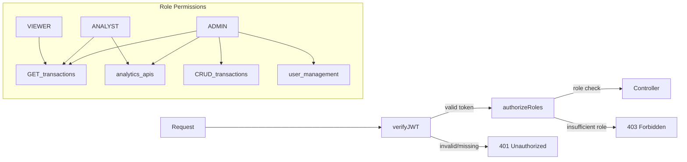

# Finance Data Processing & Access Control Dashboard — Backend Plan

## Tech Stack

- **Runtime:** Node.js 20 + TypeScript
- **Framework:** Express
- **Database:** MongoDB via Mongoose
- **Auth:** JWT (access token only — register + login)
- **Validation:** Zod (schemas co-located with DTOs)
- **API Docs:** swagger-jsdoc + swagger-ui-express _(optional enhancement)_
- **HTTP Logging:** Morgan _(lightweight, no external log aggregation)_
- **Rate Limiting:** express-rate-limit _(optional enhancement)_
- **Testing:** Jest + Supertest _(optional enhancement)_
- **Dev tools:** ts-node-dev, dotenv

---

## Folder Structure

```
fin-dash/
├── src/
│   ├── modules/
│   │   ├── auth/
│   │   │   ├── auth.controller.ts
│   │   │   ├── auth.service.ts
│   │   │   ├── auth.routes.ts
│   │   │   └── auth.dto.ts          (Zod schemas: register + login)
│   │   ├── users/
│   │   │   ├── user.controller.ts
│   │   │   ├── user.service.ts
│   │   │   ├── user.repository.ts
│   │   │   ├── user.model.ts        (Mongoose schema)
│   │   │   ├── user.routes.ts
│   │   │   └── user.dto.ts
│   │   ├── transactions/
│   │   │   ├── transaction.controller.ts
│   │   │   ├── transaction.service.ts
│   │   │   ├── transaction.repository.ts
│   │   │   ├── transaction.model.ts
│   │   │   ├── transaction.routes.ts
│   │   │   └── transaction.dto.ts
│   │   └── analytics/
│   │       ├── analytics.controller.ts
│   │       ├── analytics.service.ts
│   │       └── analytics.routes.ts
│   ├── common/
│   │   ├── middleware/
│   │   │   ├── verifyJWT.ts
│   │   │   ├── authorizeRoles.ts
│   │   │   └── rateLimiter.ts       (optional enhancement)
│   │   ├── errors/
│   │   │   ├── AppError.ts          (base custom error)
│   │   │   ├── HttpErrors.ts        (NotFoundError, ForbiddenError, etc.)
│   │   │   └── errorHandler.ts      (Express global error middleware)
│   │   └── utils/
│   │       ├── response.ts          (standard API response shape)
│   │       └── pagination.ts
│   ├── config/
│   │   ├── env.ts                   (typed env via Zod)
│   │   └── swagger.ts               (optional enhancement)
│   ├── database/
│   │   ├── connection.ts
│   │   └── seed.ts
│   └── app.ts                       (Express app factory)
│   └── server.ts                    (entry point)
├── tests/                           (optional enhancement)
│   ├── auth.test.ts
│   ├── transactions.test.ts
│   └── analytics.test.ts
├── .env.example
├── jest.config.ts
├── tsconfig.json
└── package.json
```

---

## Database Schema

### Users Collection

- `_id` ObjectId (PK)
- `name` String (required)
- `email` String (unique, indexed)
- `password` String (bcrypt hashed)
- `role` Enum: `VIEWER | ANALYST | ADMIN`
- `status` Enum: `ACTIVE | INACTIVE`
- `createdAt / updatedAt` timestamps

### Transactions Collection

- `_id` ObjectId (PK)
- `amount` Number (required, > 0)
- `type` Enum: `INCOME | EXPENSE`
- `category` String (required, indexed)
- `date` Date (required, indexed)
- `description` String (optional)
- `createdBy` ObjectId → ref Users (indexed)
- `deletedAt` Date (soft delete, null by default)
- `createdAt / updatedAt` timestamps

**Compound index:** `{ date: -1, category: 1 }` for analytics queries

---

## API Route Map

### Auth `POST /api/auth/`

- `POST /register` — register new user
- `POST /login` — login, returns JWT access token

### Users `GET|PATCH /api/users/` _(admin only)_

- `GET /` — list all users (paginated)
- `GET /:id` — get user by ID
- `PATCH /:id/role` — assign role
- `PATCH /:id/status` — activate / deactivate

### Transactions `/api/transactions`

- `POST /` — create _(admin)_
- `GET /` — list with filters _(viewer/analyst/admin)_
- `GET /:id` — get by ID _(viewer/analyst/admin)_
- `PATCH /:id` — update _(admin)_
- `DELETE /:id` — soft delete _(admin)_

### Analytics `/api/analytics` _(analyst/admin)_

- `GET /summary` — total income, expense, net balance
- `GET /category-breakdown` — income/expense by category
- `GET /monthly-trends` — grouped by month (year param)
- `GET /recent` — last N transactions (default 10)

---

## RBAC Design



- `verifyJWT` middleware validates the Bearer token, decodes payload, attaches `req.user`
- `authorizeRoles(...roles)` is a factory returning middleware that checks `req.user.role`
- Routes declare required roles inline: `router.get('/', verifyJWT, authorizeRoles('VIEWER','ANALYST','ADMIN'), ...)`

---

## Analytics Query Strategy

All analytics use MongoDB **aggregation pipelines** inside `analytics.service.ts`:

- **Summary:** `$group` with `$sum` on `amount` filtered by `type`
- **Category breakdown:** `$group` by `{ type, category }`, `$sum` amount
- **Monthly trends:** `$group` by `{ year: $year, month: $month }`, `$sort` date
- **Recent:** simple `find` with `sort({ date: -1 }).limit(N)`
- All queries filter `{ deletedAt: null }` to respect soft deletes

---

## Error Handling

Centralized `errorHandler` Express middleware catches all errors:

- `AppError` subclasses carry `statusCode` + `isOperational`
- Zod validation errors → 400 with field-level details
- Mongoose duplicate key → 409
- JWT errors → 401
- Unhandled errors → 500 (logged, generic message in prod)

---

## Standard Response Shape

```json
{
  "success": true,
  "data": { ... },
  "meta": { "page": 1, "limit": 20, "total": 142 }
}
```

---

## Key Packages

- `express`, `mongoose`, `jsonwebtoken`, `bcryptjs`
- `zod`, `swagger-jsdoc`, `swagger-ui-express` _(optional)_
- `morgan`, `express-rate-limit` _(optional)_
- `jest`, `supertest`, `@types/`_, `ts-node-dev` _(optional)
- `dotenv`, `cors`, `helmet`

---

## Implementation Order

1. Project scaffold (tsconfig, package.json, .env.example)
2. Database connection + env config (Zod-validated)
3. User model + auth module (register + login, JWT)
4. RBAC middleware (verifyJWT + authorizeRoles)
5. User management routes (admin only)
6. Transaction model + CRUD routes
7. Analytics service + routes
8. Global error handler + response utils
9. Swagger/OpenAPI documentation _(optional)_
10. Morgan HTTP logging + rate limiter _(optional)_
11. Seed script + Jest tests _(optional)_
12. README

---

## What Was Removed vs Original Plan (and Why)

- **Docker / docker-compose** — Not mentioned in the assignment requirements or optional enhancements. Adds complexity without adding value for the evaluation.
- **Refresh token + logout endpoints** — The assignment only says "Authentication using tokens or sessions" as an optional. A simple register/login with JWT access token is sufficient and cleaner.
- **Winston logging** — Not mentioned in the assignment. Morgan (lightweight HTTP request logger) is enough to show awareness of logging without over-engineering.
- `**openapi3-ts` package — Replaced with `swagger-jsdoc` which generates OpenAPI spec directly from JSDoc comments — simpler and more idiomatic for Express projects.
- `**requestLogger.ts` middleware file — Consolidated into Morgan setup in `app.ts`. No need for a dedicated file.
