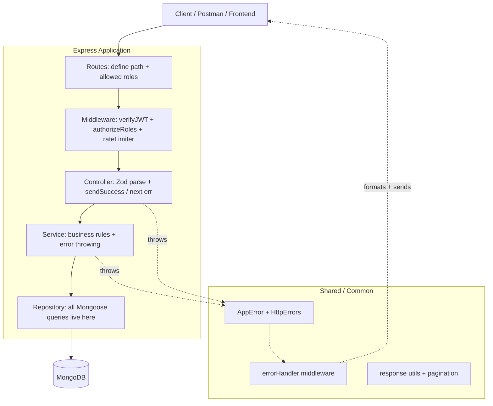
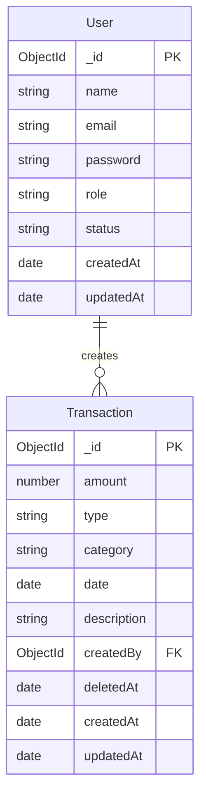
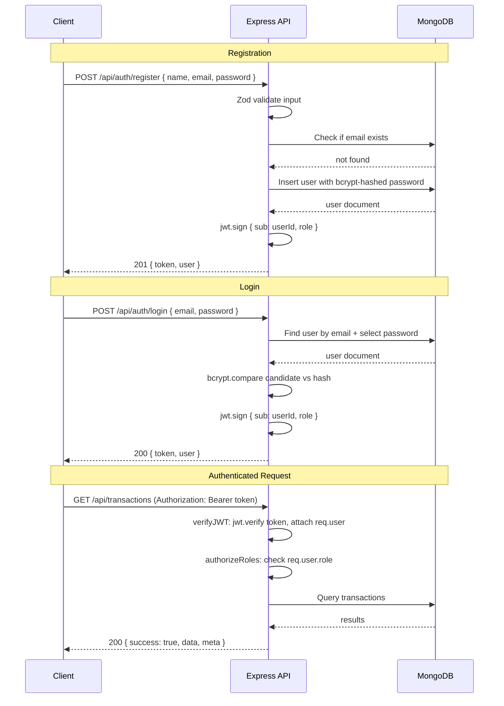
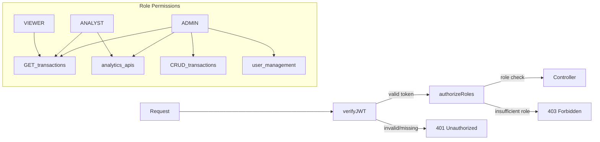
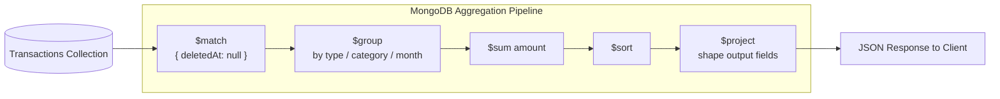
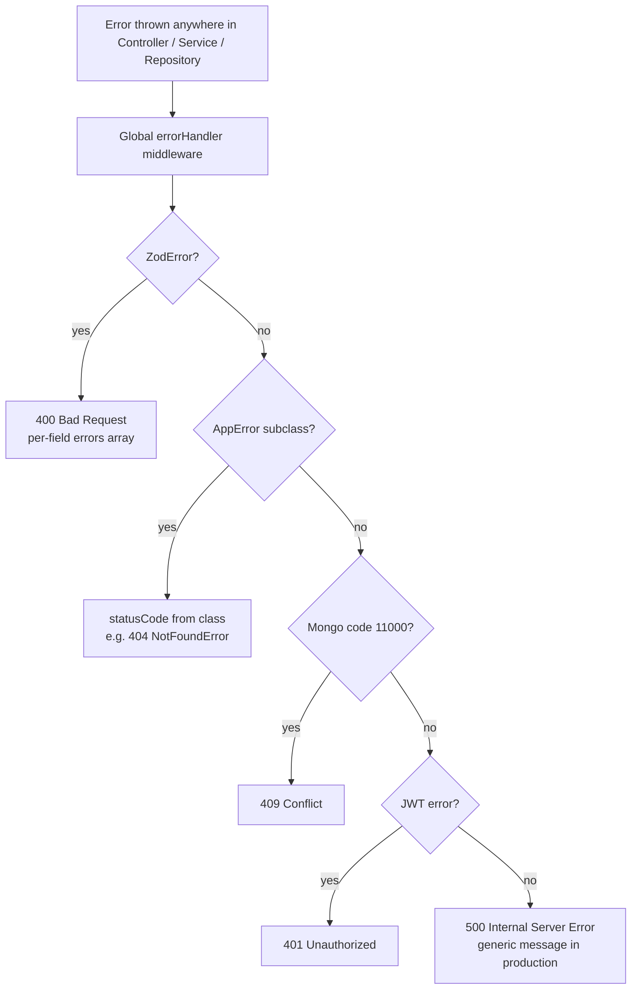

# Finance Data Processing & Access Control Dashboard

A production-ready REST API backend for a finance dashboard system with **Role-Based Access Control (RBAC)**, financial record management, and aggregated analytics.

---

## Table of Contents

- [Tech Stack](#tech-stack)
- [Key Packages](#key-packages)
- [Folder Structure](#folder-structure)
- [System Architecture](#system-architecture)
- [Database Schema](#database-schema)
- [Setup Instructions](#setup-instructions)
- [Authentication Flow](#authentication-flow)
- [API Endpoints](#api-endpoints)
- [Role Permissions](#role-permissions)
- [RBAC Design](#rbac-design)
- [Analytics Query Strategy](#analytics-query-strategy)
- [Error Handling](#error-handling)
- [Standard Response Shape](#standard-response-shape)
- [Design Decisions](#design-decisions)
- [Assumptions](#assumptions)
- [Sample Requests](#sample-requests)

---

## Tech Stack

| Layer | Technology |
|---|---|
| Runtime | Node.js 20 + TypeScript |
| Framework | Express |
| Database | MongoDB + Mongoose |
| Auth | JWT (access token) |
| Validation | Zod |
| API Docs | swagger-jsdoc + swagger-ui-express |
| HTTP Logging | Morgan |
| Rate Limiting | express-rate-limit |
| Testing | Jest + Supertest |

---

## Key Packages

| Category | Packages |
|---|---|
| Core | `express`, `mongoose`, `jsonwebtoken`, `bcryptjs` |
| Validation & Docs | `zod`, `swagger-jsdoc`, `swagger-ui-express` |
| Middleware | `morgan`, `express-rate-limit`, `helmet`, `cors` |
| Testing | `jest`, `supertest`, `ts-jest` |
| Dev | `ts-node-dev`, `dotenv`, `typescript` |

---

## Folder Structure

```
fin-dash/
├── src/
│   ├── modules/
│   │   ├── auth/
│   │   │   ├── auth.controller.ts
│   │   │   ├── auth.service.ts
│   │   │   ├── auth.routes.ts
│   │   │   └── auth.dto.ts          (Zod schemas: register + login)
│   │   ├── users/
│   │   │   ├── user.controller.ts
│   │   │   ├── user.service.ts
│   │   │   ├── user.repository.ts
│   │   │   ├── user.model.ts        (Mongoose schema)
│   │   │   ├── user.routes.ts
│   │   │   └── user.dto.ts
│   │   ├── transactions/
│   │   │   ├── transaction.controller.ts
│   │   │   ├── transaction.service.ts
│   │   │   ├── transaction.repository.ts
│   │   │   ├── transaction.model.ts
│   │   │   ├── transaction.routes.ts
│   │   │   └── transaction.dto.ts
│   │   └── analytics/
│   │       ├── analytics.controller.ts
│   │       ├── analytics.service.ts
│   │       └── analytics.routes.ts
│   ├── common/
│   │   ├── middleware/
│   │   │   ├── verifyJWT.ts
│   │   │   ├── authorizeRoles.ts
│   │   │   └── rateLimiter.ts
│   │   ├── errors/
│   │   │   ├── AppError.ts          (base custom error)
│   │   │   ├── HttpErrors.ts        (NotFoundError, ForbiddenError, etc.)
│   │   │   └── errorHandler.ts      (Express global error middleware)
│   │   └── utils/
│   │       ├── response.ts          (standard API response shape)
│   │       └── pagination.ts
│   ├── config/
│   │   ├── env.ts                   (typed env via Zod)
│   │   └── swagger.ts
│   ├── database/
│   │   ├── connection.ts
│   │   └── seed.ts
│   ├── app.ts                       (Express app factory)
│   └── server.ts                    (entry point)
├── tests/
│   ├── auth.test.ts
│   ├── transactions.test.ts
│   └── analytics.test.ts
├── .env.example
├── jest.config.js
├── tsconfig.json
└── package.json
```

---

## System Architecture

The application follows a strict **layered architecture** where each layer has a single responsibility and can only call the layer directly below it.



**Layer responsibilities:**

| Layer | File(s) | Does |
|---|---|---|
| Routes | `*.routes.ts` | Maps HTTP verbs + paths + middleware chain |
| Middleware | `verifyJWT`, `authorizeRoles` | Auth + RBAC — never touches business logic |
| Controller | `*.controller.ts` | Parses/validates input with Zod, calls service, sends response |
| Service | `*.service.ts` | Business rules, throws typed errors |
| Repository | `*.repository.ts` | All Mongoose calls — service never imports Mongoose directly |

---

## Database Schema

### Users Collection

| Field | Type | Notes |
|---|---|---|
| `_id` | ObjectId | Primary key |
| `name` | String | Required |
| `email` | String | Unique, indexed |
| `password` | String | bcrypt hashed, excluded from query results by default |
| `role` | Enum | `VIEWER \| ANALYST \| ADMIN` |
| `status` | Enum | `ACTIVE \| INACTIVE` |
| `createdAt` | Date | Auto-managed by Mongoose timestamps |
| `updatedAt` | Date | Auto-managed by Mongoose timestamps |

### Transactions Collection

| Field | Type | Notes |
|---|---|---|
| `_id` | ObjectId | Primary key |
| `amount` | Number | Required, must be > 0 |
| `type` | Enum | `INCOME \| EXPENSE` |
| `category` | String | Required, indexed |
| `date` | Date | Required, indexed |
| `description` | String | Optional |
| `createdBy` | ObjectId | Ref → Users, indexed |
| `deletedAt` | Date \| null | Soft delete — `null` means active |
| `createdAt` | Date | Auto-managed |
| `updatedAt` | Date | Auto-managed |

**Indexes:**
- `{ date: -1 }` — for date-range queries and sorting
- `{ category: 1 }` — for category filters
- `{ date: -1, category: 1 }` — compound index for analytics queries
- `{ createdBy: 1 }` — for user-scoped queries
- `{ type: 1, deletedAt: 1 }` — for type-filtered aggregations

### Entity Relationship Diagram



---

## Setup Instructions

### Prerequisites

- Node.js 20+
- MongoDB running locally (`mongodb://localhost:27017`) or a cloud URI

### 1. Clone and install

```bash
git clone https://github.com/sheelganvir/fin-dash.git
cd fin-dash
npm install
```

### 2. Configure environment

```bash
cp .env.example .env
```

Edit `.env` and set `MONGODB_URI` and `JWT_SECRET`:

```env
PORT=3000
NODE_ENV=development
MONGODB_URI=mongodb://localhost:27017/fin-dash
JWT_SECRET=change_this_to_a_long_random_string
JWT_EXPIRES_IN=7d
BCRYPT_ROUNDS=10
RATE_LIMIT_WINDOW_MS=900000
RATE_LIMIT_MAX=100
```

### 3. Seed demo data

```bash
npm run seed
```

This creates 4 demo users and 60 sample transactions (including 2 soft-deleted ones to demonstrate that feature).

**Demo accounts** (password for all: `Password1`):

| Email | Role |
|---|---|
| admin@findash.com | ADMIN |
| analyst@findash.com | ANALYST |
| viewer@findash.com | VIEWER |

### 4. Start the server

```bash
# Development (with hot reload)
npm run dev

# Production
npm run build && npm start
```

Server: `http://localhost:3000`  
Swagger UI: `http://localhost:3000/api-docs`  
Health check: `http://localhost:3000/health`

### 5. Run tests

```bash
# Requires a running MongoDB instance
npm test

# With coverage report
npm run test:coverage
```

---

## Authentication Flow

JWT-based auth is stateless — the server issues a signed token at login and never stores session state.



---

## API Endpoints

### Auth

| Method | Endpoint | Description | Auth required |
|---|---|---|---|
| POST | `/api/auth/register` | Register a new user (default role: VIEWER) | No |
| POST | `/api/auth/login` | Login and receive JWT token | No |

### Users *(Admin only)*

| Method | Endpoint | Description |
|---|---|---|
| GET | `/api/users` | List all users (paginated, filterable by role/status) |
| GET | `/api/users/:id` | Get user by ID |
| PATCH | `/api/users/:id/role` | Assign a role to a user |
| PATCH | `/api/users/:id/status` | Activate or deactivate a user |

### Transactions

| Method | Endpoint | Roles | Description |
|---|---|---|---|
| POST | `/api/transactions` | ADMIN | Create a transaction |
| GET | `/api/transactions` | VIEWER, ANALYST, ADMIN | List with filters + pagination |
| GET | `/api/transactions/:id` | VIEWER, ANALYST, ADMIN | Get by ID |
| PATCH | `/api/transactions/:id` | ADMIN | Update a transaction |
| DELETE | `/api/transactions/:id` | ADMIN | Soft-delete a transaction |

**Supported query filters for `GET /api/transactions`:**

| Parameter | Type | Description |
|---|---|---|
| `page` | integer | Page number (default: 1) |
| `limit` | integer | Items per page (default: 20) |
| `type` | string | `INCOME` or `EXPENSE` |
| `category` | string | Partial match (case-insensitive) |
| `startDate` | ISO date | Filter from date |
| `endDate` | ISO date | Filter to date |

### Analytics *(Analyst and Admin only)*

| Method | Endpoint | Description |
|---|---|---|
| GET | `/api/analytics/summary` | Total income, expense, net balance |
| GET | `/api/analytics/category-breakdown` | Income/expense totals per category |
| GET | `/api/analytics/monthly-trends?year=2025` | Monthly income/expense/net grouped by month |
| GET | `/api/analytics/recent?limit=10` | Most recent N transactions |

---

## Role Permissions

| Action | VIEWER | ANALYST | ADMIN |
|---|:---:|:---:|:---:|
| Register / Login | ✓ | ✓ | ✓ |
| View transactions | ✓ | ✓ | ✓ |
| Create transaction | ✗ | ✗ | ✓ |
| Update transaction | ✗ | ✗ | ✓ |
| Delete transaction | ✗ | ✗ | ✓ |
| View analytics summary | ✗ | ✓ | ✓ |
| View category breakdown | ✗ | ✓ | ✓ |
| View monthly trends | ✗ | ✓ | ✓ |
| View recent transactions | ✗ | ✓ | ✓ |
| Manage users (list, role, status) | ✗ | ✗ | ✓ |

---

## RBAC Design

Access control flows through two chained middleware functions applied at the route level:



- `verifyJWT` — validates the Bearer token, decodes the payload, and attaches `req.user = { id, role }` to the request
- `authorizeRoles(...roles)` — factory function that returns middleware checking `req.user.role` against the allowed set
- Routes declare required roles inline:

```typescript
router.get('/', verifyJWT, authorizeRoles('VIEWER', 'ANALYST', 'ADMIN'), getTransactions);
router.post('/', verifyJWT, authorizeRoles('ADMIN'), createTransaction);
```

---

## Analytics Query Strategy

All analytics endpoints use MongoDB **aggregation pipelines** inside `analytics.service.ts`. No computation happens in JavaScript — everything is pushed down to the database.



| Endpoint | Pipeline Strategy |
|---|---|
| `/summary` | `$match` active records → `$group` by `type` → `$sum` amount |
| `/category-breakdown` | `$group` by `{ type, category }` → `$sum` amount → `$sort` |
| `/monthly-trends` | `$match` by year → `$group` by `{ year, month, type }` → merge into monthly objects |
| `/recent` | `find` with `{ deletedAt: null }` → `sort({ date: -1 })` → `limit(N)` |

All pipelines include `{ deletedAt: null }` in their `$match` stage to automatically exclude soft-deleted records from all analytics.

---

## Error Handling

A single centralized `errorHandler` Express middleware in `src/common/errors/errorHandler.ts` catches all errors thrown anywhere in the application:



| Error Type | HTTP Status | Handled By |
|---|---|---|
| Zod validation failure | 400 | `ZodError` instanceof check — returns per-field details |
| Custom `AppError` subclasses | varies | `AppError` instanceof check — uses `statusCode` from class |
| Mongoose duplicate key (`code 11000`) | 409 | Name + code check |
| `JsonWebTokenError` | 401 | JWT error name check |
| `TokenExpiredError` | 401 | JWT error name check |
| Any unhandled error | 500 | Catch-all — generic message in production |

Custom error classes (`src/common/errors/HttpErrors.ts`):

```typescript
BadRequestError   → 400
UnauthorizedError → 401
ForbiddenError    → 403
NotFoundError     → 404
ConflictError     → 409
```

---

## Standard Response Shape

All API responses — success and error — follow a consistent envelope:

**Success:**
```json
{
  "success": true,
  "data": { },
  "meta": { "page": 1, "limit": 20, "total": 142, "totalPages": 8 }
}
```
> `meta` is only included on paginated list endpoints.

**Error:**
```json
{
  "success": false,
  "message": "Descriptive error message"
}
```

**Validation error (400):**
```json
{
  "success": false,
  "message": "Validation error",
  "errors": [
    { "field": "email", "message": "Invalid email address" },
    { "field": "password", "message": "Password must be at least 8 characters" }
  ]
}
```

---

## Design Decisions

### RBAC via middleware chaining

Access control is enforced at the route level using two reusable middleware functions: `verifyJWT` and `authorizeRoles`. Controllers are completely unaware of auth logic — they only receive a request with `req.user` already attached. This is the clearest separation of concerns.

### Repository pattern

Each module has a dedicated repository (`user.repository.ts`, `transaction.repository.ts`) that encapsulates all Mongoose calls. The service layer holds business logic and calls the repository. Controllers only parse/validate input and format the response. This makes services independently testable.

### Soft delete

Transactions use `deletedAt: Date | null` instead of physical deletion. All queries and aggregation pipelines filter `{ deletedAt: null }` so deleted records are invisible through the API but remain in the database for audit purposes.

### Zod validation at the controller boundary

DTOs are Zod schemas defined alongside each module. Parsing happens in the controller before anything reaches the service. Zod parse errors bubble up to the centralized `errorHandler` which returns structured `400` responses with per-field messages.

### MongoDB aggregation for analytics

Analytics endpoints use MongoDB's native `$group`, `$sum`, and `$project` pipeline stages instead of fetching documents and computing totals in Node.js. This keeps analytics performant regardless of dataset size and avoids unnecessary data transfer between the database and the application.

### Zod-validated environment config

All environment variables are parsed and validated through a Zod schema at startup (`src/config/env.ts`). If any required variable is missing or malformed, the process exits immediately with a clear error message — no silent failures at runtime.

---

## Assumptions

1. **Registration is open** — any user can self-register and gets the VIEWER role by default. An admin must manually elevate roles. This matches a realistic "invite by admin" workflow where a user signs up but gets minimal access until promoted.

2. **JWT is stateless** — no refresh token or logout endpoint. The token is valid for `JWT_EXPIRES_IN` (default 7 days). For a production system, a refresh token with a server-side blocklist would be added.

3. **Soft delete is one-way** — once a transaction is soft-deleted, it is not recoverable through the API. A future admin-only "restore" endpoint could be added if needed.

4. **Analytics ignore soft-deleted records** — intentional, as deleted records should not affect financial summaries.

5. **Transactions are created on behalf of the logged-in admin** — `createdBy` is set to `req.user.id` automatically and is not accepted from the request body.

---

## Sample Requests

### Register

```http
POST /api/auth/register
Content-Type: application/json

{
  "name": "Jane Doe",
  "email": "jane@example.com",
  "password": "Password1"
}
```

**Response 201:**
```json
{
  "success": true,
  "data": {
    "token": "eyJhbGci...",
    "user": {
      "id": "665f1a...",
      "name": "Jane Doe",
      "email": "jane@example.com",
      "role": "VIEWER",
      "status": "ACTIVE"
    }
  }
}
```

### Login

```http
POST /api/auth/login
Content-Type: application/json

{
  "email": "admin@findash.com",
  "password": "Password1"
}
```

### Create Transaction *(Admin)*

```http
POST /api/transactions
Authorization: Bearer <token>
Content-Type: application/json

{
  "amount": 5000,
  "type": "INCOME",
  "category": "Salary",
  "date": "2025-06-01T00:00:00.000Z",
  "description": "June salary"
}
```

### Get Transactions with Filters

```http
GET /api/transactions?type=EXPENSE&category=Rent&startDate=2025-01-01&endDate=2025-06-30&page=1&limit=10
Authorization: Bearer <token>
```

### Analytics — Summary

```http
GET /api/analytics/summary
Authorization: Bearer <token>
```

**Response 200:**
```json
{
  "success": true,
  "data": {
    "totalIncome": 32500.00,
    "totalExpense": 8200.00,
    "netBalance": 24300.00
  }
}
```

### Analytics — Monthly Trends

```http
GET /api/analytics/monthly-trends?year=2025
Authorization: Bearer <token>
```

**Response 200:**
```json
{
  "success": true,
  "data": [
    { "year": 2025, "month": 1, "income": 5000, "expense": 1100, "net": 3900 },
    { "year": 2025, "month": 2, "income": 7000, "expense": 900, "net": 6100 }
  ]
}
```

### Analytics — Category Breakdown

```http
GET /api/analytics/category-breakdown
Authorization: Bearer <token>
```

**Response 200:**
```json
{
  "success": true,
  "data": [
    { "category": "Salary", "type": "INCOME", "total": 25000, "count": 5 },
    { "category": "Rent", "type": "EXPENSE", "total": 4800, "count": 6 }
  ]
}
```

### Assign Role *(Admin)*

```http
PATCH /api/users/665f1a.../role
Authorization: Bearer <admin_token>
Content-Type: application/json

{
  "role": "ANALYST"
}
```

### Activate / Deactivate User *(Admin)*

```http
PATCH /api/users/665f1a.../status
Authorization: Bearer <admin_token>
Content-Type: application/json

{
  "status": "INACTIVE"
}
```

### Error Response Examples

**400 — Validation error:**
```json
{
  "success": false,
  "message": "Validation error",
  "errors": [
    { "field": "email", "message": "Invalid email address" },
    { "field": "password", "message": "Password must be at least 8 characters" }
  ]
}
```

**401 — Unauthorized:**
```json
{ "success": false, "message": "No token provided" }
```

**403 — Forbidden:**
```json
{ "success": false, "message": "You do not have permission to perform this action" }
```

**404 — Not found:**
```json
{ "success": false, "message": "Transaction not found" }
```

**409 — Conflict:**
```json
{ "success": false, "message": "Email already registered" }
```
